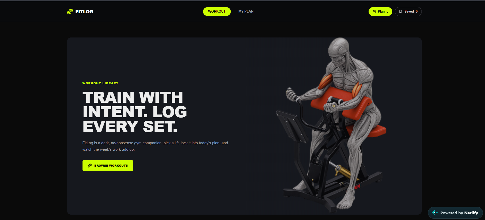

# FitLog

A responsive workout library and fitness planning application for browsing workouts, building daily plans, saving exercises, and tracking workout totals.

---

## About the Project

**FitLog** is a responsive workout library and fitness planning application built with Next.js and React.

The application allows users to browse a collection of workouts, view detailed exercise information, create a personalized **Today's Plan**, save workouts for later, and track exercise, duration, and calorie totals.

FitLog also provides search, sorting, workout completion, toast notifications, and localStorage persistence so that planned and saved workouts remain available after refreshing the page.

---

## Project Overview

FitLog provides a simple interface for discovering workouts and organizing them into a personal workout plan.

The application includes:

- A library of 12 workouts
- Detailed workout information
- Personalized Today's Plan
- Saved workouts
- Workout search and sorting
- Live workout statistics
- Workout completion tracking
- LocalStorage persistence
- Responsive design for mobile, tablet, and desktop

### Project Screenshot

<p align="center">
  
</p>

### Live Demo

🔗 **Live Site:**  
https://nextprac95bytma.netlify.app/

---

## Key Features

### 🏋️ Browse Workout Library

Explore a responsive library of workouts covering different muscle groups.

Users can browse workouts and view important information such as:

- Workout name
- Muscle group
- Difficulty
- Equipment
- Sets
- Reps
- Duration
- Calories
- Rating

### 📋 Build Today's Plan

Users can create a personalized workout plan by adding workouts to **Today's Plan**.

- Add workouts to the plan
- Maximum of five lifts
- Remove workouts
- Mark workouts as done
- Prevent duplicate workouts from being added

### 💾 Save Workouts

Users can save workouts for later and easily switch between:

- Today's Plan
- Saved Workouts

This makes it easier to keep track of workouts they want to revisit.

### 📊 Track Workout Totals

FitLog calculates live totals for the currently selected plan tab, including:

- Exercise count
- Total duration
- Total calories

### 🔍 Search & Sort

Users can quickly find workouts by:

- Workout name
- Muscle group

Workouts can also be sorted by:

- Duration
- Calories
- Rating

### 🔔 Toast Notifications

Toast notifications provide immediate feedback when users:

- Add a workout
- Save a workout
- Remove a workout
- Try to add a duplicate workout
- Perform other workout actions

### 💾 LocalStorage Persistence

Planned and saved workouts are stored using **localStorage**.

This allows the user's workout selections to remain available after refreshing or reopening the page.

### 📱 Responsive Design

FitLog is designed to provide a responsive experience across:

- Desktop
- Tablet
- Mobile

---

## Tech Stack

### Frontend

- **Next.js** — React framework for building the application
- **React** — User interface development
- **Tailwind CSS** — Styling and responsive layouts

### Libraries

- **Lucide React** — Icons and interface elements

### Data & Storage

- **JSON** — Local workout data source
- **localStorage** — Client-side persistence for plans and saved workouts

### Deployment

- **Netlify**

---

## Dependencies

The project uses the following major technologies and libraries:

- **Next.js**
- **React**
- **React DOM**
- **Tailwind CSS**
- **Lucide React**

The exact package versions are available in the project's `package.json` file.

---

## Installation & Setup

### 1. Clone the repository

```bash
git clone <YOUR_GITHUB_REPOSITORY_URL>
cd <YOUR_PROJECT_FOLDER>
